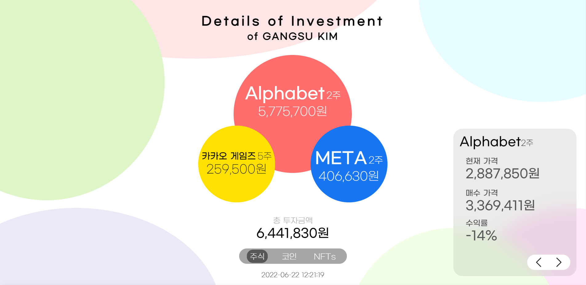
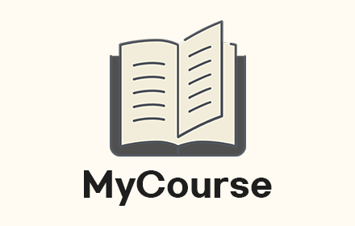

# RESUME

 

 # :man: Gangsu Kim
   
> 대학생  
> 프로그래머  
> 병역 미필  
> gangsu1813@naver.com

> College Student  
> Programmer  
> Unfulfilled  
> gangsu1813@nave.com

 

 # 🏫 Belong to
   
> 한림대학교 소프트웨어 융합대학  
> 빅데이터 전공  
> 3학년  

> School of Software at Hallym Univ.  
> Major of Big Data  
> Junior  

 

<!-- >> ## Most comfortable   -->
 # 💻 Language
> ##   
>> 프로그램을 제작하는 데 있어서 가장 능숙한 언어입니다.  
>> 간단한 프로그램부터 웹 연동, 데이터 베이스 연동 등의 복잡한 부분까지 개발 가능합니다.  
>> [GOLocker](#golocker-20182020), [SmartLEADer][SmartLEADer] 와 같은 프로그램을 본 언어로 개발하였습니다.  
>
>> Most comfortable language for developing programs  
>> Possible to build simple programs to complex programs using WEB and Database   
>> [GOLocker](#golocker-20182020), [SmartLEADer][SmartLEADer] are made of Autohotkey   
 
> ##    
>> HTML과 CSS를 이용하여 간단한 웹페이지 제작이 가능합니다.  
>> javaScript, PHP와 같은 Backend 언어와의 연동 작업도 할 수 있습니다.  
>> [GO-API Docs.](http://api.go-guma.com/) 사이트 와 GO-API 서비스를 위의 언어로 개발 하였습니다.
>
>> Can build simple web pages using HTML and CSS.  
>> Work with Backend language such as javaScript and PHP.  
>> [GO-API Docs.](http://api.go-guma.com/) and GO-API Service were built using above languages

> ##   
>> 상속, Interface, Thread의 요소들을 이용해 프로그래밍 할 수 있는 능력이 있습니다.  
>> 자료구조, 알고리즘 과목을 수강하면서 Linked List, Stack, Queue, Heap 구조를 학습하였습니다.
>
>> Ability to program using Extends, Interface, Thread.  
>> Learned Linked List, Stack, Queue, and Heap structure while taking 'Data Structure' and 'Algorithm'.  
<!-- >> ##    -->

 

 # 📖 Projects
> ## Details of Investment (2022.05 ~ 2022.06)  
>     
>> 2022년 1학기 웹프로그래밍 강의 기말과제  
>> 개인 프로젝트  
>> 개발 언어 : HTML, CSS, JS, PHP  
>> Github : [DoI Github][DOI_git]    
>> 데모 페이지 : [DoI DEMO](http://go-guma.com/demo/doi/)  
>
>> 2022 Spring semester final project of 'Web Programming' course  
>> Solo Project  
>> Develop Language : HTML, CSS, JS, PHP  
>> Github : [DoI Github][DOI_git]    
>> Demo page : [DoI DEMO](http://go-guma.com/demo/doi/)  

> ## MyCourse (2022.01 ~ )
>     
>> Coursemos 기반 E-Learning 플랫폼을 위한 크롬 Extension  
>> 개발 언어 : HTML, CSS, JS  
>> 개인 프로젝트  
>> Github : [MyCourse Github][MyCourse_git]  
>> Chrome 웹 스토어 : [MyCourse 크롬 웹 스토어][MyCourse_chrome]
>
>> Chrome Extension for Coursemos based E-Learning platform    
>> Develop Language : HTML, CSS, JS  
>> Solo Project
>> Github : [MyCourse Github][MyCourse_git]  
>> Chrome Web Store : [MyCourse Chrome Web Store][MyCourse_chrome]

> ## Traum (2021.09 ~ 2022.02)
>> 한림대학교 소속 창업동아리  
>> 센서 인식 기술을 이용한 실시간 좌석 인식 시스템  
>> 개발 언어 및 기술 : HTML, CSS, JS, PHP, 아두이노  
>> 팀 프로젝트
> 
>> Start-up club at Hally Univ.  
>> Real-time based seating recognition system using Arduino sensors.  
>> Develop Language and Technology : HTML, CSS, JS, PHP, Arduino  
>> Team Project

> ## ACM (2021.03 ~ 2021.08)
>   
>> 한림대학교 소속 창업동아리  
>> IoT 기반 펫 케어 시스템  
>> 개발 언어 및 기술 : Python, Raspberry Pi  
>> 역할 : 라즈베리파이 파트 개발 (30%)   
>> 팀 프로젝트
> 
>> Start-up club at Hally Univ.  
>> IoT based pet care system  
>> Develop Language and Technology : Python, Raspberry Pi  
>> Part : Developed Raspberry Pi part (30%)  
>> Team Project

> ## CORONA VIEW (2020 ~ )
>   
>> GO-API를 활용한 사용자의 선택에 따른 확진자를 보여주는 크롬 Extension  
>> 개인 프로젝트  
>> Github : [CORONAView Github][CORONAView_git]  
>
>> Showing COVID-19 infected data by each city from user choice using GO-API through chrome Extension  
>> Solo Project  
>> Github : [CORONAView Github][CORONAView_git]  

> ## GO API (2020 ~ )
>   
>> API소개 : [GO-API][GO-API_Link]  
>> 16개 광역시,도의 각 시,군,구별 COVID-19 확진자 현황  
>> 개발 언어 : PHP, JavaScript, HTML, CSS, Json  
>> 개인 프로젝트  
>
>>> API Intro : [GO-API][GO-API_Link]  
>> Current status of COVID-19 confirmed patients in South Korea  
>> Develop Language : PHP, JavaScript, HTML, CSS, Json  
>> Solo Project  

> ## GOLocker (2018~2020)
>   
>> BLOG : [GOLocker][GOLocker_Link]  
>> 화면을 보호해 주는 화면 보호기  
>> 개발 언어 : Autohotkey, PHP  
>> 개인 프로젝트  
>
>> BLOG : [GOLocker][GOLocker_Link]  
>> Protect showing display  
>> Develope Language : Autohotkey, PHP  
>> Solo Project  

 

 # 🏆 Award
> 제 32회 한국정보올림피아드 강원도대회 중학생부 동상 (2015)  
> 한림대학교 2021 SW Week UI/UX 설계안 공모전 은상 (2021)  
> 한림대학교 2021 SW Week GitHub 이력서 콘테스트 해커톤 금상 (2021)  
> 한림대학교 2022년 1학기 캡스톤 디자인 경진대회 대상 (2022)

> The 32nd Korea Olympiad in Informatics Gangwon-do Middle School Student 3rd place (2015)  
> Hallym University 2021 SW Week UI/UX Design Contest 2nd place (2021)  
> Hallym University 2021 SW Week GitHub Resume Contest Hackathon 1st place (2021)  
> Hallym University 2022 Spring Capston Design Contest 1st place (2022)

 

 # 🎓 Education
> 한림대학교 소프트웨어 융합대학 (2020 ~ )  
> 원주 대성고등학교 (2017.08 ~ 2020)  
> 미국 콜로라도주 Arvada West High School (2016.09 ~ 2017.07)  
> 원주 대성고등학교 (2016.03 ~ 2016.08)  

> School of Software at Hallym Univ., Chunchon-si, South Korea(2020 ~ )  
> Wonju DaeSung High School, Wonju-si, South Korea (2017.08 ~ 2020)  
> Arvada West High School, Denver, Colorado, United States (2016.09 ~ 2017.07)  
> Wonju DaeSung High School, Wonju-si, South Korea (2016.03 ~ 2016.08)  

 

 # 💯 GPA
> |학기|전체 성적|전공 성적|
> |:---:|:---:|:---:|
> |2020년 1학기|3.64|3.5|
> |2020년 2학기|4.25|4.5|
> |2021년 1학기|4.17|4.5|
> |2021년 2학기|4.12|4.2|
> |2022년 1학기|4.24|4.5|
> |**총합**|**4.11**|**4.31**|
> 
> *4.5 만점*  
> 학점에 대한 상세한 내용은 [*이곳*][Courses_kor] 에서 확인하실 수 있습니다.

> |Semester|GPA|Major GPA|
> |:---|:---:|:---:|
> |2020 Spring|3.14|3.0|
> |2020 Fall|3.75|4.0|
> |2021 Spring|3.67|4.0|
> |2021 Fall|3.62|3.7|
> |2022 Spring|3.74|4.0|
> |**Average**|**3.61**|**3.81**|  
> 
> *Max 4.0*  
> Click [*here*][Courses_Eng] to check details of courses

 

> # Branding
> 
>> # GO-GUMA Corp.
>> Programming Corporation.  
>> Since. 2016  
>> Brand site : [GO-GUMA][GO-GUMA]  
>> github : [GO-GUMA Github.][GO-GUMA git]

<!-- Markdown Links -->
[GOLocker_Link]: https://m.blog.naver.com/gangsu1813/221341360059
[SmartLEADer]: https://github.com/GO-GUMA/SmartLEADer
[GO-API_Link]: http://api.go-guma.com/
[CORONAView_git]: https://github.com/GO-GUMA/CORONAView
[CORONAView_chrome]: https://chrome.google.com/webstore/detail/%EC%BD%94%EB%A1%9C%EB%82%98-view/apejbphnejmhjninoemlaghpemekneol
[MyCourse_git]: https://github.com/GO-GUMA/MyCourse
[MyCourse_chrome]: https://chrome.google.com/webstore/detail/mycourse/hccakmcanlejgbahgglencckckkbhohn?hl=ko
[GO-GUMA]: http://www.go-guma.com
[GO-GUMA git]: https://github.com/GO-GUMA
[Courses_kor]: Courses_Kor.md
[Courses_Eng]: Courses_Eng.md
[DOI_git]: https://github.com/GangsuKim/2022-web-programming-project
